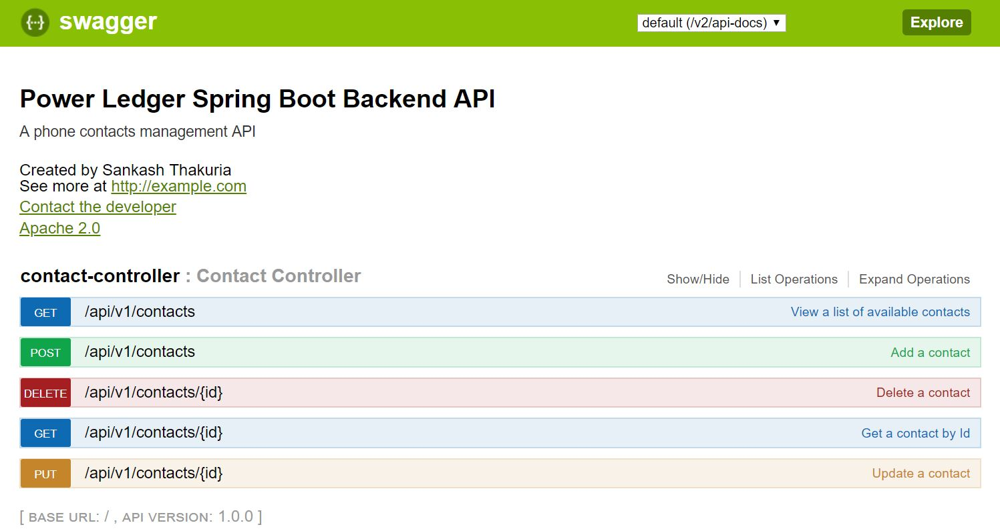

# Spring boot backend REST API

### Simple app showing CRUD operations against a database
The app uses H2 as the backend database.

### Requirements
For building and running the application you need:
* Java 1.8 or higher
* Maven 3 or higher

### Running the application locally
There are several ways to run a Spring Boot application on your local machine. One way is to execute the main method in the com.powerledger.assignment.backend.powerledgerassignmentbackend.PowerledgerAssignmentBackendApplication class from your IDE.

Alternatively you can use the [Spring Boot Maven plugin](https://docs.spring.io/spring-boot/docs/current/reference/html/build-tool-plugins-maven-plugin.html) like so:

```shell
mvn spring-boot:run
```
The application will run on localhost port 8080. To change the port to a different port please change the port configuration in application.properties file.


### Running tests
You can run tests by using the following maven command
```shell
mvn test
```

### Visualizing and testing from the browser

This sample uses Swagger to provide the API documentation. You can use the same page to send requests to the API. 
When the application has started please go to [http://localhost:8080/swagger-ui.html](http://localhost:8080/swagger-ui.html) 
 